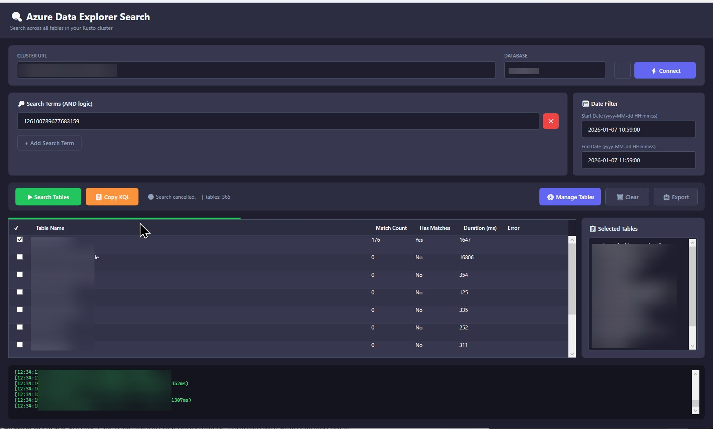

# Azure Data Explorer - Table Search Tool

A modern WPF desktop application for searching across all tables in an Azure Data Explorer (Kusto) cluster.



## Features

- **Modern Dark Theme UI**: Beautiful, modern dark-themed interface built with WPF
- **Azure AD Authentication**: Secure authentication using Azure Active Directory with interactive login
- **Cluster Connection**: Connect to any Azure Data Explorer cluster with database selection
- **Connection History**: Quick access to previously used cluster/database combinations
- **Automatic Table Discovery**: Lists all tables in the specified database
- **Table Selection**: Choose specific tables or search across all tables
- **Multiple Search Terms**: Search for multiple terms with AND logic
- **Fuzzy Table Matching**: Quickly filter and select tables with fuzzy search
- **Sequential Table Search**: Searches all tables for matching records within a date range
- **Progress Tracking**: Real-time progress bar and status updates during search operations
- **Detailed Results**: Shows table name, match status, count, query duration, and errors
- **Export Functionality**: Export search results to CSV format
- **Comprehensive Logging**: Real-time log window showing all operations and errors

## Requirements

- Windows 10 or later
- .NET 8.0 SDK or Runtime
- Azure Data Explorer cluster access
- Azure AD credentials with appropriate permissions

## Installation

### Option 1: Build from Source

1. Clone or download this repository
2. Open a terminal/command prompt
3. Navigate to the `KustoSearchApp` directory
4. Run:
   ```bash
   dotnet build
   ```

### Option 2: Run Directly

```bash
cd KustoSearchApp
dotnet run
```

## Usage

### 1. Connect to Cluster

1. Enter your **Cluster URL** (e.g., `https://wawsweu.kusto.windows.net`)
2. Enter the **Database Name**
3. Click **Connect** (or use the 📋 history button to select a previous connection)
4. Sign in with your Azure AD credentials when prompted
5. Wait for the connection to establish and tables to load

### 2. Configure Search

1. **Search Terms**: Add one or more search terms (they are combined with AND logic)
2. **Start Date**: Enter the beginning of your date range (format: `yyyy-MM-dd HH:mm:ss`)
3. **End Date**: Enter the end of your date range
4. **Select Tables**: Click "Select Tables" to choose specific tables or search all

### 3. Execute Search

1. Click **Search All Tables**
2. Monitor progress in the status bar and log window
3. View results in the data grid showing:
   - Table Name
   - Has Matches (Yes/No)
   - Match Count
   - Query Duration (milliseconds)
   - Error messages (if any)

### 4. Export Results

1. Click **Export to CSV**
2. Choose a location to save the file
3. Results are saved with timestamp in filename

## Configuration

### Authentication Methods

The application uses Azure AD User Prompt Authentication by default. The authentication dialog will appear when connecting to the cluster.

### Query Behavior

- **Sequential Processing**: Tables are queried one at a time to avoid overwhelming the cluster
- **Delay Between Queries**: 500ms delay between each table query
- **Date Range**: Uses `ingestion_time()` function to filter records
- **Search Method**: Uses KQL `| search` operator for broad text search across all columns

### Sample KQL Query Generated

```kql
TableName
| where ingestion_time() between (datetime(2024-12-01T00:00:00.000Z) .. datetime(2024-12-08T23:59:59.000Z))
| search "error"
| count
```

## Dependencies

The application uses the following NuGet packages:

- **Microsoft.Azure.Kusto.Data** (v14.0.3): Kusto client library
- **Azure.Identity** (v1.17.1): Azure authentication
- **CsvHelper** (v33.1.0): CSV export functionality

## Troubleshooting

### Connection Issues

- Verify cluster URL format (must start with `https://`)
- Ensure database name is correct
- Check Azure AD credentials have appropriate permissions
- Verify network connectivity to the cluster

### Authentication Errors

- Clear browser cache and retry
- Ensure your account has access to the specified database
- Check if MFA is required for your organization

### Query Errors

- Some tables may not have `ingestion_time()` - these will show errors
- Check date range is valid (start < end)
- Ensure search phrase doesn't contain special characters that break KQL

### Performance Tips

- Use specific date ranges to reduce query time
- For large databases (100+ tables), expect several minutes for completion
- Monitor the log window for errors on specific tables

## Advanced Features

### Custom Date/Time Format

The date pickers use the format: `yyyy-MM-dd HH:mm:ss`

This allows precise timestamp selection for your queries.

### Error Handling

The application continues searching even if individual table queries fail. Errors are logged and displayed in the results grid for troubleshooting.

### Cancellation

Currently, searches cannot be cancelled mid-operation. A future enhancement will add a "Cancel" button.

## Building for Distribution

To create a standalone executable:

```bash
cd KustoSearchApp
dotnet publish -c Release -r win-x64 --self-contained
```

The executable will be in: `bin\Release\net8.0-windows\win-x64\publish\`

## License

This project is provided as-is for educational and internal use.

## Support

For issues or questions:
- Check the log window for detailed error messages
- Verify Azure Data Explorer cluster is accessible
- Ensure proper Azure AD permissions are configured

## Version History

- **v1.1.0** - Enhanced Release
  - Modern WPF dark theme UI
  - Connection history for quick access to previous clusters/databases
  - Multiple search terms with AND logic
  - Fuzzy table selection with search
  - Improved table selection dialog
  - Enhanced date/time input

- **v1.0.0** - Initial release
  - Azure AD authentication
  - Table discovery and search
  - CSV export
  - Progress tracking and logging
